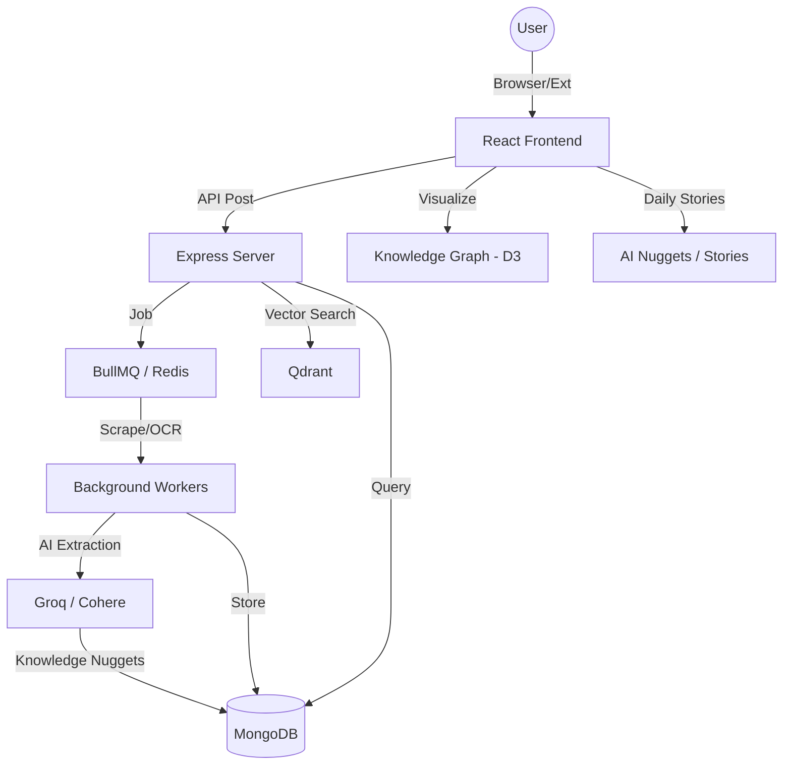

# 🌌 MemoryOS: Your Immersive Knowledge Galaxy

> **"Transform your digital chaos into a luminous garden of connected insights."**

MemoryOS is a professional-grade, AI-powered knowledge management platform designed for deep thinkers and creators. It doesn't just save your links; it synthesizes them, connects them, and surfaces them exactly when you need them.

---

## ✨ Core Systems

### 🧠 The Nexus (AI Orchestrator)
A universal, intent-aware AI chat interface that lives on top of your entire memory database.
*   **Hybrid Search**: Combines keyword extraction with vector-based semantic search.
*   **Context Pruning**: Advanced AI prompt optimization to reduce token usage while maintaining deep context.
*   **Source Awareness**: Every AI response cites your specific memories for 100% accuracy.

### ✍️ Second Draft (Creation Studio)
A premium, distraction-free environment for transforming notes into polished content.
*   **Minimalist UI**: Notion-inspired writing focus using custom Vanilla CSS.
*   **Contextual Sidebars**: Your relevant memories are automatically resurfaced based on what you are writing.
*   **AI Synthesis**: Multi-model (OpenAI + Cohere) pipeline for generating drafts, social posts, and blog outlines.

### 🕸️ Knowledge Galaxy (Visualization)
Your memories visualized as a living, breathing constellation.
*   **D3.js Powered**: Dynamic, force-directed graph visualization of your knowledge nodes.
*   **Thematic Clusters**: Automatic grouping of memories based on shared topics and semantic overlap.
*   **Interactive Explorer**: Fly through your knowledge and discover hidden connections.

### 📥 Intelligent Capture
*   **One-Click Save**: One-click save from anywhere on the web via our Chrome Extension.
*   **Deep Parsing**: High-fidelity scraping for web articles, YouTube transcripts, and PDFs.
*   **OCR Support**: Automated text extraction from images using Tesseract.js.

### 🌟 AI Nuggets & Knowledge Stories
A daily, bite-sized insight engine built directly into your home feed.
*   **Automated Extraction**: Every saved item is processed by **Groq (Llama 3.3 70B)** to extract 3-5 punchy "Knowledge Nuggets".
*   **Interactive Stories**: View your insights in a premium, Instagram-style stories component.
*   **Video Pinpointing**: AI-extracted nuggets from YouTube videos are pinned to specific timestamps for quick navigation.

---

## 🛠️ Technology Stack

### Frontend
*   **Framework**: [React 19](https://react.dev/) + [Vite 8](https://vitejs.dev/)
*   **State & Data**: [TanStack Query v5](https://tanstack.com/query) + [Axios](https://axios-http.com/)
*   **Visuals**: [D3.js](https://d3js.org/) + [Framer Motion](https://www.framer.com/motion/)
*   **Icons**: [Lucide React](https://lucide.dev/)
*   **PWA**: Offline-ready with `vite-plugin-pwa`

### Backend
*   **Engine**: [Node.js](https://nodejs.org/) + [Express 5](https://expressjs.com/)
*   **Database**: [MongoDB Atlas](https://www.mongodb.com/atlas) (Mongoose)
*   **Vector Engine**: [Qdrant](https://qdrant.tech/) for semantic similarities.
*   **Caching & Queue**: [Redis (Upstash)](https://upstash.com/) + [BullMQ](https://docs.bullmq.io/) for background workers.
*   **AI Engine**: [OpenAI GPT-4o](https://openai.com/) + [Cohere (Rerank & Embed)](https://cohere.com/)

---

## 🏗️ Project Architecture



---

## 🚀 Technical Highlights

> [!TIP]
> **Intent-Based Caching**: MemoryOS uses a sophisticated Redis-based caching layer that understands user intent, reducing redundant AI API calls by up to 60%.

> [!IMPORTANT]
> **Hybrid Layout Engine**: The application utilizes a custom-built hybrid layout system that transitions between a standard application shell and a "Distraction-Free" studio mode for the Second Draft experience.

---

## 📂 Project Structure

```text
MemoryOS/
├── frontend/             # React + Vite application
│   ├── src/modules/      # Feature-based architecture (Auth, Composer, Items, Nexus)
│   └── src/layouts/      # Shell and Studio layouts
├── backend/              # Node.js + Express API
│   ├── services/         # Business logic (AI, Topic, Item)
│   ├── workers/          # BullMQ background processing
│   └── controllers/      # Route handlers
└── memoryos-extension/   # Chrome Extension (Manifest v3)
```

---

## 🏁 Getting Started

### 1. Project Setup
- Clone the repository: `git clone <repo-url>`
- Install dependencies (Frontend): `cd frontend && npm install`
- Install dependencies (Backend): `cd backend && npm install`

### 2. Environment Variables (.env)
You must create a `.env` file in both the `frontend` and `backend` directories.

#### **Backend (`/backend/.env`)**
| Key | Description |
|---|---|
| `MONGO_URI` | MongoDB Atlas Cluster connection string. |
| `JWT_SECRET` | Secret key for signing JSON Web Tokens. |
| `PORT` | Port number for the Express server (default: 3000). |
| `FRONTEND_URL` | URL of the React application (e.g., `http://localhost:5173`). |
| `GROQ_API_KEY` | API Key for Groq AI inference. |
| `COHERE_API_KEY` | API Key for Cohere embeddings and reranking. |
| `VOYAGE_API_KEY` | API Key for Voyage AI embeddings. |
| `REDIS_URL` | Redis connection string for caching and sessions. |
| `BULLMQ_REDIS_URL` | Dedicated Redis URL for BullMQ background workers. |
| `QDRANT_URL` & `QDRANT_API_KEY` | Qdrant Cloud credentials for vector search. |

#### **Frontend (`/frontend/.env`)**
| Key | Description |
|---|---|
| `VITE_API_URL` | The base URL of your backend API (e.g., `http://localhost:3000/api`). |

### 3. Run Development Servers
- Start Backend: `cd backend && npm run dev`
- Start Frontend: `cd frontend && npm run dev`

---
*Created with ❤️ by the kapil.*
